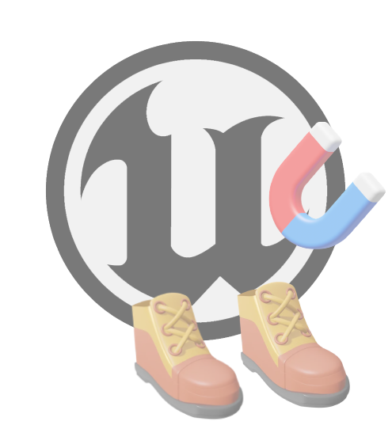
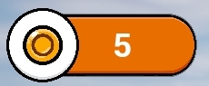
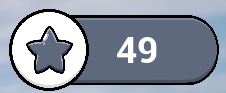
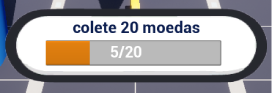
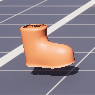
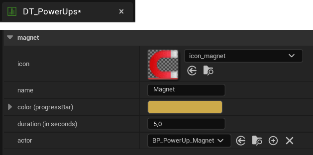
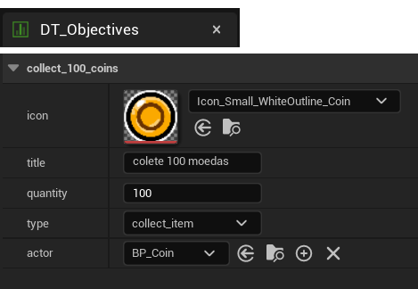
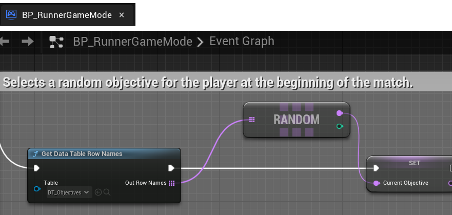
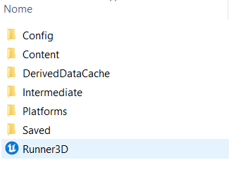

<h1 align="center">
   
   Endless Runner 3D 
</h1>

<h4 align="center">Simples projeto 3D desenvolvido na Unreal Engine 5.2 utilizando 100% Blueprints</h4>

## Sobre:

A sua missão é correr pelo maior tempo possível, evitando colisões com obstáculos gerados aleatoriamente no mundo.

***

## 📽 Demonstração: 

https://github.com/HenriqueCacerez/endless-runner-UE5/assets/110671999/611c5642-2e0d-46ec-84f3-1eaa00629753

***

## 📜 Funcionalidades:

- Mundo expansivo com obstáculos gerados aleatoriamente.
- Mova-se lateralmente, pule ou deslize por baixo dos obstáculos.
- Aumento gradual da velocidade do jogador ao longo da corrida.
- Coleta de moedas com exibição do total acumulado na tela.
- Exibição da distância percorrida em metros.
- Itens bônus concedem habilidades ao jogador por um curto período de tempo.
- Uso de sockets para permitir que o personagem interaja com os itens bônus.
- Tela de fim de jogo com opção de iniciar uma nova partida.

***

## 🎨 Widgets:

Todos os Widgets estão localizados no diretório "**Game/Blueprints/Widgets**"

| Imagem | Classe | Descrição |
| --- | --- | --- |
|  | **UI_CollectedCoins** | Total de moedas coletadas
|  | **UI_DistanceTraveled** | Distância percorrida em metros |
|  | **UI_PowerUpProgressBar** | Tempo restante do bônus atual |
|  | **UI_CurrentObjective** | Objetivo a ser realizado |

***

## 🎁 Bônus:

Todos os itens especiais estão localizados no diretório "**Game/Pickups/PowerUps**"

| Imagem | Classe | Descrição |
| --- | --- | --- |
|  | **BP_PowerUp_Magnet** | Atrai todas as moedas próximas para o jogador |
|  | **BP_PowerUp_Boots** | Aumenta o pulo do jogador em 1.5x |

Você pode modificar o tempo de duração do bônus em "**DT_PowerUps**", localizado em "**Game/Blueprints/DataTables**".

***

## 🏆 Objetivos:

Gerencie os objetivos em **DT_Objectives**, localizado em "**Game/Blueprints/DataTables**".

Atualmente, apenas um objetivo é selecionado aleatoriamente para o jogador durante a partida. 

A seleção é controlada por "**BP_RunnerGameMode**" em "**Game/Blueprints**".

***

## Download

Faça o [download](https://github.com/HenriqueCacerez/endless-runner-UE5/archive/refs/heads/main.zip) do projeto e abra clicando em "**Runner3D.uproject**".

